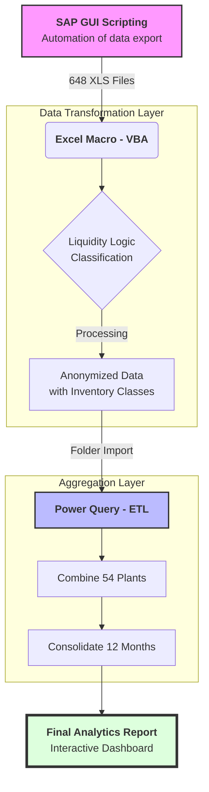

# SAP_GUI_automation

**EN: This is the code to automate SAP transaction J3RFLVMOBVED to get the stock by material from multiple plants.**
**If you need to upload data for the whole year for 12 months for 54 plants it can save one month of your work instead of manual work.**

RU: Это скрипт для автоматизации выгрузки из транзакции SAP J3RFLVMOBVED - запасы материалов с документами для нескольких заводов. Особенность отчета по запасам в том, что он делает выгрузку по месяцам с кумулятивным эффектом. 
Если вам нужно сделать выгрузку за весь год по 12 месяцев по 54 завода, как мне, то эта программа поможет вам сэкономить один месяц работы аналитика вместо проставления дат и кодов заводов руками.

**Note: This repository contains an anonymized version of a real-world business project. All sensitive data has been replaced with synthetic datasets to comply with NDA requirements, while preserving the original logic and analytical methodology.**

**It gives cummulative results strating from the 1st of January. Example: if you need the report for January, February, and March, it will upload as follow: 1st file (01 Jan 2025 - 31 Jan 2025), 2nd file (01 Jan 2025 - 28 Feb 2025), 3rd file (01 Jan 2025 - 31 March 2025).**

Например, если нужен отчет за три месяца 2025 за январь, февраль и март, то он выгрузит согласно этим датам: 1 файл (01.01.25 - 31.12.25), 2ой файл (01.01.25 - 28.02.25) и 3ий файл (01.01.25 - 31.03.25).

**This is the image of the path in SAP where you can launch this script amended with your plants' name and other data.** 
Это путь в SAP через который вы можете запустить скрипт как обычный макрос, предварительно исправив код под ваши данные:

The data to amend / Данные в коде для корректировки: 
1) the codes of the plants as it is in your system / коды заводов, как в вашей системе. Example: "0201", "0255"
2) months you needed for report / месяца для отчета. Example: "02", "05"
3) Check the year / Год отчета
4) Path to the folder where you would like to store the results / Путь к месту назначения отчетов.
